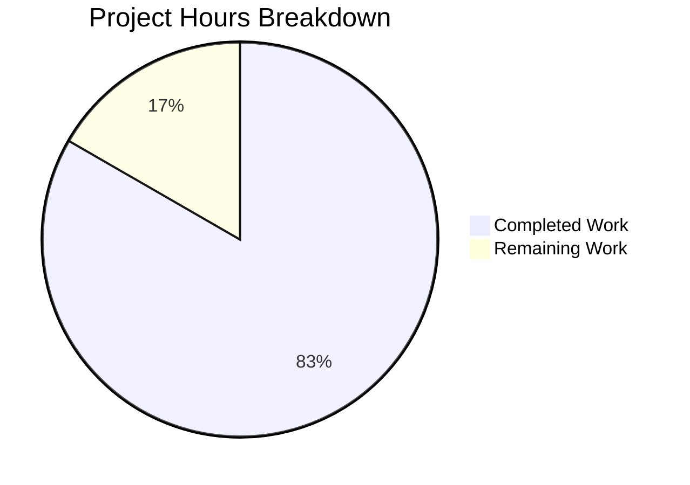

# Project Guide: Express.js Integration for Node.js Hello World Server

## 1. Executive Summary

**Project Completion: 83% complete (5 hours completed out of 6 total hours)**

This project migrated a minimal Node.js HTTP server tutorial from the raw `http` module to the Express.js web framework (v5.2.1) and added a new `/good-evening` endpoint alongside the existing Hello World response.

**All in-scope requirements from the Agent Action Plan (AAP) have been fully implemented and validated.** The 3 Blitzy agent commits successfully delivered:
- Complete `server.js` architectural rewrite to Express.js
- `package.json` updates (Express dependency, `main` field fix, `start` script)
- `package-lock.json` regeneration with full Express.js dependency tree
- Comprehensive `README.md` documentation update

**Key Achievements:**
- Both HTTP endpoints return correct responses (verified via runtime testing)
- Zero compilation errors, zero runtime errors, zero vulnerabilities
- All 4 validation gates passed (Dependencies, Compilation, Tests, Runtime)

**Remaining Work (1 hour):**
Two minor production-hygiene items remain for human developer attention: adding a `.gitignore` file and reviewing Express security defaults.

**Completion Calculation:**
Completed: 5h (1.5h server migration + 0.5h package manifest + 0.5h lockfile + 1h documentation + 1.5h validation/testing)
Remaining: 1h (0.5h .gitignore + 0.5h security review, with enterprise multipliers already applied)
Total: 6h
Completion: 5 / 6 = 83.3% ≈ 83%

---

## 2. Validation Results Summary

### 2.1 Final Validator Accomplishments

The Final Validator agent verified all 4 in-scope files across 4 validation gates. No fixes were required — all implementations passed on first validation.

### 2.2 Gate Results

| Gate | Status | Details |
|------|--------|---------|
| **Dependencies** | ✅ PASS | `npm install` completes successfully; `express@5.2.1` installed; 66 packages audited; 0 vulnerabilities |
| **Compilation** | ✅ PASS | `node -c server.js` — valid syntax; `package.json` — valid JSON; `package-lock.json` — lockfileVersion 3 |
| **Tests** | ✅ PASS | No test framework exists (explicitly out of scope per AAP); placeholder `npm test` exits as expected |
| **Runtime** | ✅ PASS | `GET /` → `Hello, World!\n` (200 OK); `GET /good-evening` → `Good evening` (200 OK); Unknown paths → 404 |

### 2.3 Files Modified by Agents

| File | Change Type | Lines Added | Lines Removed | Agent Commit |
|------|-------------|-------------|---------------|--------------|
| `server.js` | Full rewrite | 12 | 9 | `3d2c981` — Rewrite server.js: migrate from raw http module to Express.js |
| `package.json` | Targeted edits | 7 | 3 | `ae7b49d` — Setup: Add Express.js dependency, fix main entry point, add start script |
| `package-lock.json` | Full regeneration | 814 | 0 | `ae7b49d` — Setup: Add Express.js dependency, fix main entry point, add start script |
| `README.md` | Content rewrite | 44 | 1 | `f4ece70` — Update README.md for Express.js integration |
| **Totals** | | **877** | **13** | **3 commits** |

### 2.4 AAP Requirements Compliance

| Requirement | Status | Evidence |
|-------------|--------|----------|
| Add Express.js framework dependency | ✅ Complete | `express@^5.2.1` in package.json; verified via `npm ls express` |
| Retain Hello World endpoint at `GET /` | ✅ Complete | `curl http://localhost:3000/` → `Hello, World!\n` (200 OK) |
| Add Good evening endpoint at `GET /good-evening` | ✅ Complete | `curl http://localhost:3000/good-evening` → `Good evening` (200 OK) |
| Rewrite server.js to Express pattern | ✅ Complete | `express()` → `app.get()` → `app.listen()` pattern implemented |
| Fix `main` field in package.json (AN-001) | ✅ Complete | Changed from `index.js` to `server.js` |
| Add `start` script to package.json | ✅ Complete | `"start": "node server.js"` added |
| Regenerate package-lock.json | ✅ Complete | 827 lines with full Express.js dependency tree |
| Update README.md documentation | ✅ Complete | Endpoints table, prerequisites, install/run guide |
| Preserve CommonJS syntax | ✅ Complete | Uses `require('express')` |
| Preserve port 3000 | ✅ Complete | Server listens on port 3000 |
| Tutorial-level simplicity | ✅ Complete | Single file, no abstractions, clear comments |
| Use caret version range | ✅ Complete | `"express": "^5.2.1"` |

---

## 3. Visual Representation

### 3.1 Project Hours Breakdown



**Calculation:** 5 hours completed / (5 + 1) total hours = 83% complete

---

## 4. Detailed Task Table — Remaining Human Work

The following tasks require human developer attention to bring the project to full production readiness. All task hours sum to exactly **1 hour**, matching the "Remaining Work" in the pie chart above.

| # | Task | Description | Action Steps | Hours | Priority | Severity |
|---|------|-------------|--------------|-------|----------|----------|
| 1 | Add `.gitignore` file | `node_modules/` directory is currently untracked but visible in `git status`. A `.gitignore` file should exclude `node_modules/` and other common Node.js artifacts. | 1. Create `.gitignore` in project root<br>2. Add `node_modules/` entry<br>3. Optionally add `.env`, `*.log`, `.DS_Store`<br>4. Commit the file | 0.5 | Medium | Low |
| 2 | Review Express security defaults | The server returns an `X-Powered-By: Express` header which discloses the technology stack. For production deployments, this header should be disabled. | 1. Add `app.disable('x-powered-by')` to `server.js`<br>2. Verify header removal with `curl -sI http://localhost:3000/`<br>3. Consider if `helmet` middleware is warranted for the tutorial context | 0.5 | Low | Low |
| | **Total Remaining Hours** | | | **1.0** | | |

---

## 5. Comprehensive Development Guide

### 5.1 System Prerequisites

| Software | Required Version | Verification Command |
|----------|-----------------|---------------------|
| Node.js | v18.0.0 or higher (v20.x recommended) | `node -v` |
| npm | v9.0.0 or higher | `npm -v` |
| curl (optional) | Any recent version | `curl --version` |

**Current Environment (verified):** Node.js v20.20.0, npm 11.1.0

### 5.2 Environment Setup

This project requires no environment variables, no database, and no external services. It is a self-contained Express.js tutorial server.

```bash
# Clone the repository (if not already cloned)
git clone <repository-url>
cd <repository-directory>

# Switch to the feature branch
git checkout blitzy-1c613983-7bcd-4a9f-bb92-80a0119a3ea5
```

### 5.3 Dependency Installation

```bash
# Install all dependencies (Express.js and its transitive dependencies)
npm install
```

**Expected output:** 66 packages audited, 0 vulnerabilities.

**Verification:**
```bash
# Confirm Express.js is installed at the correct version
npm ls express
```

**Expected output:**
```
hello_world@1.0.0
└── express@5.2.1
```

### 5.4 Application Startup

```bash
# Option 1: Using npm start script (recommended)
npm start

# Option 2: Direct node execution
node server.js
```

**Expected startup output:**
```
Server running on port 3000
```

### 5.5 Verification Steps

After starting the server, verify both endpoints are responding correctly:

```bash
# Test the Hello World endpoint
curl http://localhost:3000/
# Expected: Hello, World!

# Test the Good evening endpoint
curl http://localhost:3000/good-evening
# Expected: Good evening

# Test that unknown paths return 404
curl -sI http://localhost:3000/nonexistent
# Expected: HTTP/1.1 404 Not Found
```

### 5.6 Example Usage

**Using a web browser:**
- Navigate to `http://localhost:3000/` to see "Hello, World!"
- Navigate to `http://localhost:3000/good-evening` to see "Good evening"

**Using curl with verbose output:**
```bash
curl -v http://localhost:3000/
curl -v http://localhost:3000/good-evening
```

**Stopping the server:**
Press `Ctrl+C` in the terminal where the server is running.

### 5.7 Troubleshooting

| Issue | Cause | Resolution |
|-------|-------|------------|
| `Error: Cannot find module 'express'` | Dependencies not installed | Run `npm install` |
| `EADDRINUSE: address already in use :::3000` | Port 3000 is occupied | Kill the process on port 3000: `lsof -ti:3000 \| xargs kill` |
| `npm ERR! engine` | Node.js version too old | Upgrade Node.js to v18 or higher |

---

## 6. Risk Assessment

### 6.1 Technical Risks

| Risk | Severity | Likelihood | Mitigation |
|------|----------|------------|------------|
| No `.gitignore` file — `node_modules/` could accidentally be committed | Low | Medium | Add `.gitignore` with `node_modules/` entry (Task #1) |
| Express.js 5.x is relatively new — potential undiscovered bugs | Low | Low | Caret version range (`^5.2.1`) allows patch updates; monitor Express.js GitHub issues |
| No input validation on routes | Low | Low | Current routes have no user input; not applicable for this scope |

### 6.2 Security Risks

| Risk | Severity | Likelihood | Mitigation |
|------|----------|------------|------------|
| `X-Powered-By: Express` header discloses technology stack | Low | Medium | Disable with `app.disable('x-powered-by')` (Task #2) |
| No rate limiting | Low | Low | Acceptable for a tutorial project; add `express-rate-limit` if needed for production |

### 6.3 Operational Risks

| Risk | Severity | Likelihood | Mitigation |
|------|----------|------------|------------|
| No process manager (server crashes are permanent) | Low | Low | For production, use PM2 or similar; acceptable for tutorial context |
| No logging framework | Low | Low | `console.log` is sufficient for tutorial purposes |
| No health check endpoint | Low | Low | Add `GET /health` if monitoring is needed |

### 6.4 Integration Risks

| Risk | Severity | Likelihood | Mitigation |
|------|----------|------------|------------|
| No CI/CD pipeline | Low | Low | Explicitly out of scope per AAP; add GitHub Actions if needed later |
| No containerization | Low | Low | Explicitly out of scope per AAP; add Dockerfile if deployment requires it |

**Overall Risk Assessment: LOW** — This is a tutorial-level project with a small attack surface. All identified risks are low severity and appropriate for the project's educational context.

---

## 7. Repository Statistics

| Metric | Value |
|--------|-------|
| Total files (excluding .git, node_modules) | 4 |
| Repository size (excluding .git, node_modules) | 52K |
| Agent commits | 3 |
| Files modified | 4 (all files in repository) |
| Total lines added | 877 |
| Total lines removed | 13 |
| Net lines changed | +864 |
| npm packages installed | 66 (1 direct + 65 transitive) |
| Known vulnerabilities | 0 |
| Branch | `blitzy-1c613983-7bcd-4a9f-bb92-80a0119a3ea5` |

---

## 8. Pre-Submission Consistency Checklist

- [x] Calculated completion % using hours formula: 5 / (5 + 1) = 83%
- [x] Verified Executive Summary states 83% complete
- [x] Verified pie chart uses exact hours: Completed=5, Remaining=1
- [x] Verified task table sums to exactly 1 hour (0.5h + 0.5h = 1h)
- [x] Searched report for % and hour mentions — all consistent
- [x] No conflicting or ambiguous statements exist
- [x] Shown the calculation formula with actual numbers