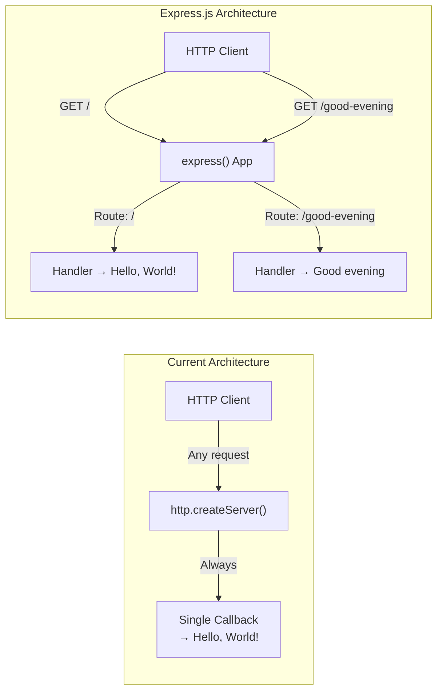

# Technical Specification

# 0. Agent Action Plan

## 0.1 Intent Clarification

### 0.1.1 Core Feature Objective

Based on the prompt, the Blitzy platform understands that the new feature requirement is to integrate the Express.js web framework into an existing minimal Node.js HTTP server tutorial project and extend it with a new endpoint. Specifically:

- **Add Express.js framework dependency**: The existing project (`hello_world` v1.0.0) currently uses the built-in Node.js `http` module with zero external dependencies. The user requires replacing this raw HTTP handling approach with Express.js, the most popular Node.js web framework, to gain proper routing, middleware support, and a more idiomatic server architecture.

- **Retain the existing "Hello World" endpoint**: The current `server.js` responds with `Hello, World!\n` to every HTTP request on port 3000. This behavior must be preserved as a dedicated route under the Express.js routing system, maintaining the original greeting response at the root path (`/`).

- **Add a new "Good evening" endpoint**: A second HTTP endpoint must be created that returns the plain-text response `Good evening` when accessed. This endpoint will be served on a distinct route path (e.g., `GET /good-evening`) to demonstrate Express.js's multi-route capability.

- **Implicit requirement — server.js architectural migration**: Since the current server uses `http.createServer()` with a single monolithic callback, integrating Express.js necessitates a full rewrite of `server.js` to adopt the Express application pattern (`express()` → `app.get()` → `app.listen()`). This is an architectural migration, not a simple patch.

- **Implicit requirement — package manifest update**: Adding Express.js requires updating `package.json` with the new dependency entry and regenerating `package-lock.json` to lock the resolved dependency tree.

- **Implicit requirement — documentation update**: The `README.md` should reflect the updated project state, noting that Express.js is now used and documenting the available endpoints.

### 0.1.2 Special Instructions and Constraints

- **Tutorial context**: The user explicitly describes this project as "a tutorial of node js server." All changes must maintain tutorial-level simplicity and readability — no over-engineering, no unnecessary abstractions, and code should remain approachable for learners.

- **Preserve CommonJS syntax**: The existing codebase uses `require()` (CommonJS). Express.js integration must follow the same module system for consistency: `const express = require('express')`.

- **Maintain port and hostname configuration**: The existing server binds to `127.0.0.1:3000`. The Express.js migration should preserve port `3000` as the listening port.

- **Backprop integration awareness**: Per the `README.md` directive ("test project for backprop integration. Do not touch!"), this project serves as a Backprop integration test fixture. The feature addition will modify the project structure, which is acceptable as the user has explicitly requested these changes, overriding the frozen-state directive.

- **No test infrastructure required**: The project has no existing test framework (the `scripts.test` in `package.json` is a placeholder). No test files are specified for creation in this feature addition.

### 0.1.3 Technical Interpretation

These feature requirements translate to the following technical implementation strategy:

- To **integrate Express.js**, we will add `express` version `5.2.1` (latest stable release from npm) as a production dependency in `package.json` and regenerate `package-lock.json` via `npm install`.

- To **preserve the Hello World response**, we will create an Express route `app.get('/')` that sends `Hello, World!\n` as the plain-text response body, matching the exact current output of the raw `http` server.

- To **add the Good evening endpoint**, we will create a new Express route `app.get('/good-evening')` that sends `Good evening` as the plain-text response body.

- To **migrate the server architecture**, we will rewrite `server.js` to replace `http.createServer()` with `express()` app initialization, replace the monolithic request callback with discrete route handlers, and replace `server.listen()` with `app.listen()`.

- To **update project metadata**, we will modify `package.json` to include `express` in the `dependencies` object, fix the `main` entry point from the incorrect `index.js` to `server.js` (resolving known Anomaly AN-001), and add a `start` script for `node server.js`.

- To **update documentation**, we will modify `README.md` to describe both available endpoints and the Express.js dependency.

## 0.2 Repository Scope Discovery

### 0.2.1 Comprehensive File Analysis

The repository is a flat, four-file Node.js project with zero subdirectories (excluding `.git`). Every file in the repository is directly affected by this feature addition. The following table maps each existing file to its modification scope:

| File | Current Purpose | Modification Type | Reason |
|---|---|---|---|
| `server.js` | HTTP server using raw `http` module; responds `Hello, World!\n` to all requests | **MODIFY (full rewrite)** | Replace `http.createServer()` with Express.js app; add route-based request handling; add new `/good-evening` endpoint |
| `package.json` | npm manifest; zero dependencies; placeholder test script | **MODIFY** | Add `express` to `dependencies`; fix `main` field from `index.js` to `server.js`; add `start` script |
| `package-lock.json` | Lockfile v3; empty dependency tree | **MODIFY (auto-regenerated)** | Regenerated by `npm install` to include Express.js and its transitive dependencies |
| `README.md` | Project identity and "Do not touch!" directive | **MODIFY** | Update documentation to reflect Express.js usage and list both endpoints |

**Integration point discovery:**

- **API endpoints**: The current server has a single catch-all handler (no routing). Express.js introduces explicit route definitions:
  - `GET /` — Returns `Hello, World!\n` (migrated from existing behavior)
  - `GET /good-evening` — Returns `Good evening` (new endpoint)

- **Module system**: The single import `const http = require('http')` in `server.js` (line 1) will be replaced with `const express = require('express')`.

- **Server binding**: The `server.listen(port, hostname, callback)` pattern on line 12 of `server.js` will be replaced with `app.listen(port, callback)` using Express's simplified binding interface.

- **No database models/migrations**: The project has no persistence layer; none is needed for this feature.

- **No middleware/interceptors**: No middleware exists currently. The Express.js integration introduces Express's built-in middleware stack but no custom middleware is required for these simple routes.

- **No service classes or dependency injection**: The project has no service layer or DI container. The feature addition keeps all logic within `server.js`.

### 0.2.2 Web Search Research Conducted

The following research was conducted to inform this feature addition:

- **Express.js latest stable version**: Confirmed as `5.2.1` via npm registry (`npm view express version`). Express 5.x is now the default `latest` tag on npm as of the 5.1.0 release.

- **Express 5 compatibility with Node.js 20**: Express 5 requires Node.js 18 or higher. The project environment runs Node.js 20.20.0, which is fully compatible.

- **Express.js basic routing patterns**: Reviewed official Express routing documentation at `expressjs.com/en/guide/routing.html`. The standard pattern for defining routes is `app.get(path, handler)` with `res.send()` for sending responses.

- **Express 5 changes from Express 4**: Express 5 includes automatic promise rejection handling in async routes, updated path-to-regexp matching, and removal of deprecated APIs. For this simple tutorial, none of these breaking changes affect the implementation — the basic `app.get()` / `res.send()` API is identical across Express 4 and 5.

### 0.2.3 New File Requirements

No new source files, test files, or configuration files need to be created for this feature addition. The project's tutorial nature and minimal scope mean that all changes are modifications to existing files:

- **No new source files**: The entire server logic remains in `server.js`. Express.js routing for two endpoints does not warrant extracting routes into separate modules.

- **No new test files**: The project has no test infrastructure (placeholder script only). The user did not request test creation.

- **No new configuration files**: Express.js for basic routing requires no external configuration files (no `.env`, no `express.config.js`, no `routes.yaml`).

## 0.3 Dependency Inventory

### 0.3.1 Private and Public Packages

The following table lists all packages relevant to this feature addition. The project currently has zero dependencies; Express.js is the sole new addition.

| Registry | Package Name | Version | Type | Purpose |
|---|---|---|---|---|
| npm | `express` | `5.2.1` | Production dependency (new) | Web framework providing HTTP routing, middleware, and request/response handling. Replaces the raw `http` module approach with idiomatic route definitions. |

**Version verification**: The version `5.2.1` was confirmed as the current `latest` tag on npm via `npm view express version` executed against the live npm registry. Express 5.x requires Node.js ≥ 18; the project environment runs Node.js 20.20.0, confirming full compatibility.

**Transitive dependencies**: Express.js 5.2.1 brings a set of transitive dependencies (e.g., `body-parser`, `debug`, `finalhandler`, `path-to-regexp`, `qs`, `send`, `serve-static`, etc.). These are resolved and locked automatically by npm in `package-lock.json` and require no manual configuration.

### 0.3.2 Dependency Updates

**Import Updates**

The sole import statement in the project resides in `server.js` and must be replaced:

| File | Current Import | New Import | Reason |
|---|---|---|---|
| `server.js` (line 1) | `const http = require('http')` | `const express = require('express')` | Switching from Node.js built-in `http` module to the Express.js framework |

No other files in the project contain import statements. There are no test files, utility scripts, or submodules that reference the `http` module.

**External Reference Updates**

| File | Update Required | Details |
|---|---|---|
| `package.json` | Add `dependencies` block | Add `"express": "^5.2.1"` to the `dependencies` object, which does not currently exist in the manifest |
| `package.json` | Fix `main` field | Change `"main": "index.js"` to `"main": "server.js"` to resolve documented Anomaly AN-001 |
| `package.json` | Add `start` script | Add `"start": "node server.js"` to the `scripts` block for standard `npm start` usage |
| `package-lock.json` | Full regeneration | Running `npm install` will regenerate this file to include the Express.js dependency tree with lockfileVersion 3 |
| `README.md` | Update description | Document Express.js as a project dependency and describe the available endpoints |

## 0.4 Integration Analysis

### 0.4.1 Existing Code Touchpoints

**Direct modifications required:**

- **`server.js` (full rewrite — lines 1–14):** The entire file content is replaced. The current implementation uses `http.createServer()` with a monolithic callback that handles all requests identically. The Express.js migration replaces this with:
  - Line 1: Replace `const http = require('http')` with `const express = require('express')`
  - Lines 3–4: Retain the `hostname` and `port` constants (port 3000 is preserved; hostname binding becomes optional with Express's default `0.0.0.0` or can be kept as `127.0.0.1`)
  - Lines 6–10: Replace the `http.createServer()` callback with `const app = express()` initialization and discrete `app.get()` route definitions
  - Lines 12–14: Replace `server.listen(port, hostname, callback)` with `app.listen(port, callback)`

- **`package.json` (targeted field additions — 3 changes):**
  - Add `dependencies` object with `express` entry (new block after existing fields)
  - Modify `main` field from `"index.js"` to `"server.js"` (bug fix for Anomaly AN-001)
  - Add `"start": "node server.js"` to the `scripts` object

- **`README.md` (content update — lines 1–2):** Update or extend the two-line content to reflect the Express.js integration and document the two available HTTP endpoints.

**Dependency injections:** Not applicable. The project has no dependency injection container, service registry, or IoC framework. Express.js is imported directly via `require()`.

**Database/Schema updates:** Not applicable. The project has no database, no ORM, no migration system, and no persistent storage.

### 0.4.2 Integration Flow

The following diagram illustrates how the Express.js integration changes the request handling architecture from a monolithic catch-all to route-based dispatch:



### 0.4.3 Behavioral Changes

| Aspect | Before (raw `http`) | After (Express.js) |
|---|---|---|
| **Request routing** | No routing; all requests return same response | Route-based dispatch (`GET /` and `GET /good-evening`) |
| **Unknown paths** | Returns `Hello, World!` for any path | Returns Express default 404 response (HTML or plain text) |
| **HTTP methods** | Responds to all methods (GET, POST, etc.) identically | Only `GET` method triggers the defined routes; other methods receive 404 |
| **Response headers** | Manual `res.setHeader('Content-Type', 'text/plain')` | Express sets `Content-Type` automatically via `res.send()` |
| **Startup log** | `Server running at http://127.0.0.1:3000/` | Updated log message reflecting Express.js usage |
| **Dependencies** | Zero external packages | One direct dependency (`express`) plus transitive dependencies |

## 0.5 Technical Implementation

### 0.5.1 File-by-File Execution Plan

Every file listed below MUST be modified as part of this feature addition. No new files are created; all changes are in-place modifications to the four existing files.

**Group 1 — Core Feature File:**

- **MODIFY: `server.js`** — Full rewrite to replace the raw `http` module with Express.js. The file transitions from a 14-line `http.createServer()` implementation to an Express application with two route handlers:
  - Import `express` instead of `http`
  - Initialize an Express application instance
  - Define `GET /` route returning `Hello, World!\n`
  - Define `GET /good-evening` route returning `Good evening`
  - Call `app.listen()` on port 3000 with startup confirmation log

**Group 2 — Package Manifest and Lockfile:**

- **MODIFY: `package.json`** — Three targeted changes to the npm manifest:
  - Add `"dependencies": { "express": "^5.2.1" }` block
  - Fix `"main"` field from `"index.js"` to `"server.js"` (resolves Anomaly AN-001)
  - Add `"start": "node server.js"` to the `"scripts"` block

- **MODIFY: `package-lock.json`** — Auto-regenerated by running `npm install`. The lockfile will expand from 13 lines (empty dependency tree) to include the full Express.js dependency graph locked at specific versions.

**Group 3 — Documentation:**

- **MODIFY: `README.md`** — Update the project documentation to reflect the new Express.js-based architecture and list both available HTTP endpoints with usage examples.

### 0.5.2 Implementation Approach per File

**Step 1 — Establish the Express.js foundation by modifying `server.js`:**

The current `server.js` content (14 lines using `http.createServer()`) will be replaced with an Express.js application. The Express pattern follows the standard tutorial structure: import → create app → define routes → listen.

The migrated server preserves the same port (3000) and maintains the `Hello, World!\n` response on the root path for backward compatibility, while adding the new `/good-evening` route:

```javascript
const express = require('express');
const app = express();
const port = 3000;
```

Route handlers use `res.send()` which automatically sets appropriate `Content-Type` headers and status codes.

**Step 2 — Update the project manifest by modifying `package.json`:**

The `dependencies` block is added to declare Express.js as a production dependency. The `main` field is corrected to point to the actual entry point `server.js`, and a `start` script is added for idiomatic `npm start` usage:

```json
"dependencies": { "express": "^5.2.1" }
```

**Step 3 — Regenerate `package-lock.json`:**

Running `npm install` in the project directory will resolve Express.js and all its transitive dependencies, generating a complete lockfile. This is a fully automated step.

**Step 4 — Update documentation by modifying `README.md`:**

The README is updated to describe the project as an Express.js tutorial server with two endpoints, including the route paths and expected responses.

### 0.5.3 User Interface Design

Not applicable. This project is a server-side HTTP API that returns plain-text responses. There is no user interface, no HTML rendering, no templating engine, and no frontend assets. All interaction occurs via HTTP clients (browser, `curl`, Postman, etc.).

## 0.6 Scope Boundaries

### 0.6.1 Exhaustively In Scope

Every file in the repository is within scope. The complete in-scope inventory with wildcard patterns where applicable:

**Source files:**

| Pattern | Files Matched | Modification Type | Purpose |
|---|---|---|---|
| `server.js` | `server.js` | Full rewrite | Express.js migration and new `/good-evening` route |

**Package manifests:**

| Pattern | Files Matched | Modification Type | Purpose |
|---|---|---|---|
| `package.json` | `package.json` | Targeted field additions | Add `express` dependency, fix `main`, add `start` script |
| `package-lock.json` | `package-lock.json` | Full regeneration | Lock Express.js dependency tree |

**Documentation:**

| Pattern | Files Matched | Modification Type | Purpose |
|---|---|---|---|
| `README.md` | `README.md` | Content update | Document Express.js usage and both endpoints |

**Integration points explicitly in scope:**

- `server.js` — Express.js app initialization and route registration
- `server.js` — `GET /` route handler (migrated Hello World)
- `server.js` — `GET /good-evening` route handler (new endpoint)
- `server.js` — `app.listen()` server startup on port 3000
- `package.json` — `dependencies` block (new)
- `package.json` — `scripts.start` entry (new)
- `package.json` — `main` field correction (bug fix)

### 0.6.2 Explicitly Out of Scope

The following items are NOT part of this feature addition:

- **Test infrastructure**: No test framework installation (e.g., Jest, Mocha), no test file creation, no test script updates beyond the existing placeholder. The user did not request tests.

- **CI/CD pipelines**: No GitHub Actions workflows, no `.github/` directory creation, no automated deployment configuration.

- **Docker/Containerization**: No `Dockerfile`, no `docker-compose.yml`, no container orchestration.

- **Database integration**: No database connections, no ORM setup, no migration files, no persistent storage of any kind.

- **Authentication/Authorization**: No auth middleware, no session management, no JWT or OAuth configuration.

- **Environment variable management**: No `.env` file creation, no `dotenv` dependency, no environment-specific configuration.

- **Express.js middleware beyond routing**: No `body-parser` configuration, no CORS setup, no static file serving, no custom error handling middleware.

- **Additional endpoints beyond the two specified**: Only `GET /` and `GET /good-evening` are in scope. No other HTTP methods or paths.

- **Frontend/UI assets**: No HTML templates, no CSS, no client-side JavaScript, no templating engine integration.

- **Performance optimization**: No clustering, no compression middleware, no caching headers beyond Express defaults.

- **Refactoring of existing code unrelated to integration**: The only existing code is `server.js`, which is being fully rewritten as part of the Express.js migration.

## 0.7 Rules for Feature Addition

The following rules and constraints govern the implementation of this feature addition:

- **Preserve the existing `Hello, World!\n` response**: The root path (`GET /`) must return the exact same response body as the current server. This ensures backward compatibility for any HTTP clients or integration tests (including Backprop) that depend on the current output.

- **Use Express.js as the sole framework**: The user explicitly requested Express.js. No alternative frameworks (Fastify, Koa, Hapi, etc.) should be used. The implementation must use the `express` npm package directly.

- **Maintain CommonJS module syntax**: The existing codebase uses `require()` (CommonJS). All new code must follow the same pattern. Do not introduce ES module syntax (`import`/`export`) or modify `package.json` to set `"type": "module"`.

- **Preserve port 3000**: The server must continue listening on port 3000 to maintain consistency with the existing configuration and any documentation or tooling that references this port.

- **Tutorial-level simplicity**: All code must remain simple, readable, and educational. Avoid unnecessary abstractions such as separate route files, middleware chains, controller classes, or configuration modules. The entire server should remain in a single `server.js` file.

- **Use the caret (`^`) version range for Express.js**: The `package.json` dependency should use `"express": "^5.2.1"` to allow compatible patch and minor updates within the 5.x major version, following standard npm semver conventions.

- **No hardcoded HTML responses**: Both endpoints return plain-text strings. Do not introduce HTML formatting, JSON responses, or template rendering unless explicitly requested.

- **Resolve known Anomaly AN-001**: The `main` field in `package.json` currently points to non-existent `index.js`. As part of the manifest update, correct this to `server.js` — the actual entry point. This is a low-risk bug fix bundled with the feature addition.

## 0.8 References

### 0.8.1 Repository Files Searched

The following files and folders were searched and analyzed across the codebase to derive the conclusions in this Agent Action Plan:

| Path | Type | Analysis Performed |
|---|---|---|
| `/` (root) | Folder | Full directory listing via `get_source_folder_contents`; confirmed flat 4-file structure with no subdirectories |
| `server.js` | File | Full content read (14 lines); analyzed HTTP server implementation, module imports, port binding, and request handler logic |
| `package.json` | File | Full content read (11 lines); analyzed package metadata, dependency declarations (empty), scripts, main entry point, and license |
| `package-lock.json` | File | Full content read (13 lines); analyzed lockfile version (3), empty dependency tree, and package identity metadata |
| `README.md` | File | Full content read (2 lines); analyzed project identity (`hao-backprop-test`) and immutability directive |

### 0.8.2 Technical Specification Sections Referenced

The following existing tech spec sections were retrieved and consulted for background context:

| Section | Key Information Extracted |
|---|---|
| 1.1 Executive Summary | Project purpose as Backprop integration test fixture; authored by `hxu`; zero external dependencies; single-endpoint server |
| 3.1 Technology Stack Overview | Confirmed Node.js v20.x runtime, npm v9+ (lockfileVersion 3), JavaScript ES6+, zero frameworks/libraries |
| 5.2 Component Details | Detailed `server.js` component analysis including API calls, state transitions, and interaction diagrams; Anomaly AN-001 documentation |
| package.json (Project Manifest) | Field-by-field manifest analysis; anomalies AN-001 (`main` mismatch) and AN-002 (placeholder test script) |
| server.js — Runtime HTTP Server | Runtime behavior summary; CommonJS module system; zero routing logic; zero error handling |

### 0.8.3 Web Searches Conducted

| Search Query | Key Finding |
|---|---|
| "Express.js latest stable version 2025" | Confirmed Express 5.2.1 as latest stable version on npm; Express 5.1.0 became default `latest` tag; Express 5 requires Node.js ≥ 18 |
| "Express 5 hello world tutorial basic routing" | Confirmed standard `app.get(path, handler)` routing pattern; `res.send()` for response delivery; `app.listen()` for server startup |

### 0.8.4 Environment Verification

| Check | Result |
|---|---|
| Node.js version | v20.20.0 (compatible with Express 5.x requirement of ≥ 18) |
| npm version | 11.1.0 (supports lockfileVersion 3) |
| Express.js latest on npm | 5.2.1 (confirmed via `npm view express version`) |
| Existing server functionality | Verified via `curl http://127.0.0.1:3000/` → `Hello, World!` (200 OK) |
| `.blitzyignore` files | None found in the repository |

### 0.8.5 Attachments

No attachments were provided for this project. No Figma designs, wireframes, or external design assets are associated with this feature addition.

